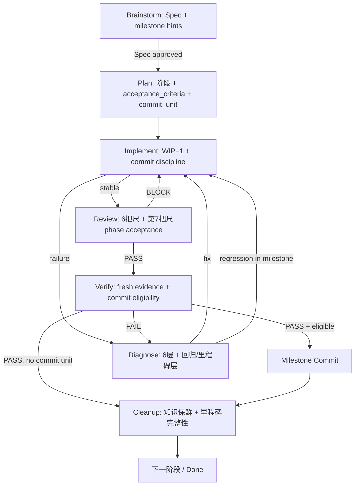
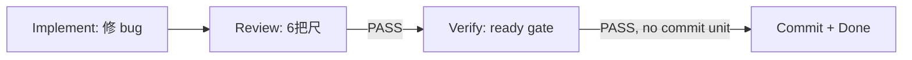

# 工作流 Skills 全面优化方案（v2）

## 设计原则：松耦合增强

**核心约束：每个 skill 独立可用，增强功能在有上游产物时激活，没有时降级到基础模式。**

所有增强都遵循"条件性增强"模式：

```
当 Executable Plan 存在且定义了阶段 acceptance_criteria 时 → 使用增强模式
当没有 Executable Plan 或只是直接修 bug 时 → 使用基础模式，功能不受影响
```

具体而言：
- `review` 没有 plan 时，仍用原有六把尺正常工作；有 plan 时，自动增加第七把尺（phase acceptance criteria 对照）
- `verify` 没有 review 记录时，仍独立收集 fresh evidence 做 ready 判定；有 review + plan 时，增加 commit eligibility 评估
- `implement` 没有 plan 的 commit unit 定义时，仍按 WIP=1 正常实现；有时，增加 commit discipline 提示
- `cleanup` 没有 milestone 记录时，仍做知识保鲜；有时，增加里程碑完整性检查
- `diagnose` 不依赖任何新增字段，仅在发现回归时增加里程碑失效的诊断维度

---

## 问题诊断（5 个核心缺陷 + 3 个其他 skill 缺陷）

### 缺陷 1：Plan 缺少阶段级验收标准

当前各阶段只有通用 checklist，没有要求每阶段写出可证伪的验收标准和对应验证命令。`Commit units` 被列为必含项但未定义结构。

### 缺陷 2：Git 提交没有形成"里程碑闭环"

没有任何 skill 定义 "verify PASS -> commit" 的闭环。commit 时机、前置条件、与验证的关系完全空白。

### 缺陷 3：Review 与 Plan 的验收标准脱节

Review 的六把尺是通用检查，不对照 plan 中的阶段级 acceptance criteria。

### 缺陷 4：Verify 缺少 Commit Gate

Verify PASS 直接路由到 cleanup，没有提交建议或 commit eligibility 评估。

### 缺陷 5：跨 Skill 追溯链断裂

缺少统一的 milestone id 串联 plan -> implement -> review -> verify -> commit。

### 缺陷 6：Brainstorm Spec 缺少里程碑预设

`brainstorm/templates/spec.md` 的 Plan Handoff 只有 active slice 和 suggested next skill，没有建议阶段划分和验收标准预设，导致 plan 需要从零定义。

### 缺陷 7：Diagnose 缺少回归和里程碑失效维度

`diagnose/references/harness-layer-patterns.md` 有 6 个诊断层，但缺少"已提交里程碑出现回归"这个场景的诊断指导。

### 缺陷 8：Cleanup 缺少提交卫生检查

`cleanup/SKILL.md` 的 Knowledge Freshness Check 不检查"是否有已验证但未提交的改动"或"里程碑提交与 recovery surface 是否一致"。

---

## 全部 8 个 Skill 的优化方案

### 1. Brainstorm — Spec 中增加里程碑预设

**文件**: [skills/brainstorm/SKILL.md](skills/brainstorm/SKILL.md), [skills/brainstorm/templates/spec.md](skills/brainstorm/templates/spec.md)

**改动**：
- `templates/spec.md` 的 `Plan Handoff` 章节扩展，增加：
  - `Suggested milestones`：建议的里程碑划分（从 Spec 层面给出粗粒度阶段建议）
  - `Per-milestone acceptance hints`：每个建议里程碑的验收标准提示（不是完整定义，留给 plan 细化）
- `SKILL.md` 第 5 步（写 Spec）中增加：Spec 应当在 Plan Handoff 中给出里程碑建议，帮助 plan 定义阶段级验收标准
- 验收标准增加：`[ ] Plan Handoff 含里程碑建议和验收提示（复杂任务）或说明为什么不需要`

**松耦合**：这只是建议性预设，plan 可以完全重新定义阶段。没有 brainstorm 产物时 plan 照常工作。

### 2. Plan — 阶段级验收标准 + Commit Unit Protocol

**文件**: [skills/plan/SKILL.md](skills/plan/SKILL.md), [skills/plan/templates/task_plan.md](skills/plan/templates/task_plan.md), [skills/plan/templates/progress.md](skills/plan/templates/progress.md)

**SKILL.md 改动**：

a) 在 "第 1 步 — 写 Executable Plan" 的必含项中，增加 **阶段级验收结构要求**：
  - 每个阶段必须包含：`acceptance_criteria`（可证伪条件）、`verification_commands`（验证命令）、`success_definition`（一句话成功定义）
  - 每个 commit unit 必须包含：scope、对应阶段、提交前置条件

b) 新增 **Commit Unit Protocol** 段落：

```markdown
## Commit Unit Protocol

Commit unit 定义何时可以提交一个里程碑。这是计划产物，不是强制流程。

当 plan 定义了 commit unit 时：
1. 每个 commit unit 绑定一个或多个阶段
2. 提交前置条件：该 scope 的实现完成 + review 无 Critical + verify PASS
3. commit message 应引用阶段名称
4. 提交后更新 recovery surface 的阶段状态

当没有 plan 或任务简单到不需要 commit unit 时：
- implement / review / verify 正常工作，不依赖 commit unit 定义
- 提交时机由用户或项目惯例决定
```

c) 验收标准增加：
  - `[ ] 每个阶段含 acceptance_criteria、verification_commands 和 success_definition`
  - `[ ] 多阶段计划定义了 commit unit 及其提交前置条件`

d) 常见反模式增加：
  - `**阶段验收标准模糊。** acceptance_criteria 必须可证伪，不允许 "完成优化"、"基本实现"`
  - `**Commit unit 无验证绑定。** 每个 commit unit 必须关联 review + verify 前置条件`

**task_plan.md 改动**：

将阶段模板升级为结构化验收块：

```markdown
### 阶段 N - [阶段名称]

状态：`pending`
Acceptance criteria：[可证伪的完成条件]
Verification commands：[`命令1`, `命令2`]
Success definition：[一句话：什么状态算成功]

- [ ] 任务项 1
- [ ] 任务项 2
```

增加 **Commit Protocol** 章节：

```markdown
## 提交协议

| Commit unit | 对应阶段 | Scope | 前置条件 | Message 模板 |
| --- | --- | --- | --- | --- |
| M1 | 阶段 1-2 | [范围] | review 无 Critical + verify PASS | [模板] |
| M2 | 阶段 3 | [范围] | review 无 Critical + verify PASS | [模板] |
```

**progress.md 改动**：

增加里程碑提交记录区域：

```markdown
## 里程碑提交记录

| 时间 | Commit unit | Commit Hash | Review 状态 | Verify 状态 | Message |
| --- | --- | --- | --- | --- | --- |
```

### 3. Implement — Commit Discipline

**文件**: [skills/implement/SKILL.md](skills/implement/SKILL.md)

**改动**：

a) 在 "执行纪律" 中增加 **Commit Discipline** 段：

```markdown
### Commit Discipline

当 Executable Plan 定义了 commit unit 时：
- 不在 review/verify 之前做正式 milestone commit
- 实现过程中的中间保存不算正式里程碑
- commit scope 对应 plan 中定义的 commit unit

当没有 Executable Plan 或任务是直接修 bug 时：
- 按项目惯例或用户指示提交
- 仍建议在提交前至少跑过相关验证
```

b) 常见反模式增加：`**未经验证就提交里程碑。** 当 plan 定义了 commit unit 时，正式 commit 应在 review + verify 之后。`

c) 输出格式增加：`Commit status: not committed; pending review + verify | no commit unit defined`

### 4. Diagnose — 回归诊断和里程碑失效

**文件**: [skills/diagnose/SKILL.md](skills/diagnose/SKILL.md), [skills/diagnose/references/harness-layer-patterns.md](skills/diagnose/references/harness-layer-patterns.md)

**SKILL.md 改动**：

a) 在 "第 3 步 — 定位变化面" 中增加：当失败出现在已提交里程碑的范围内时，先确认是否该里程碑引入了回归，查看该 commit 的 diff 和对应的 verify 证据是否仍有效

b) 在路由规则中增加：`| 根因是已提交里程碑的回归 | 记录到 recovery surface + `implement` 修复 + 重新 verify |`

**harness-layer-patterns.md 改动**：

增加第七层 **回归 / 里程碑层**：

```markdown
## 回归 / 里程碑层

信号：
- 已提交的里程碑范围内出现新失败
- verify 曾经 PASS 的检查现在 FAIL
- 后续改动破坏了之前已验证的行为

处理：
- 先确认是哪个 commit 引入了回归（git bisect 或 diff 分析）
- 检查原 verify 证据是否覆盖了当前失败路径
- 修复后需要重新 verify 受影响的里程碑范围
```

**松耦合**：没有里程碑体系时，这一层的信号自然不会匹配，诊断流程不受影响。

### 5. Review — 条件性第七把尺 + Commit Eligibility

**文件**: [skills/review/SKILL.md](skills/review/SKILL.md), [skills/review/references/premature-completion-patterns.md](skills/review/references/premature-completion-patterns.md)

**SKILL.md 改动**：

a) 在 "检查重点" 中增加第七把尺，用条件语言：

```markdown
- **Phase acceptance criteria**（当 Executable Plan 存在时）：对照当前阶段的 acceptance_criteria 逐条检查是否满足。没有 Executable Plan 时，此项自动跳过，review 仍用上述六把尺正常工作。
```

b) 在 "第 2 步" 中增加：`当 Executable Plan 存在时，读取当前阶段的 acceptance_criteria 和 verification_commands 作为额外对照维度`

c) 输出格式增加（条件性字段）：

```text
Phase acceptance: <all met | partial | unmet | no plan>
Commit eligibility: <eligible | not eligible | no commit unit>
```

d) 验收标准增加：`[ ] 当 Executable Plan 存在时，已对照阶段 acceptance criteria 检查`

e) 常见反模式增加：`**有 plan 不对照。** 当存在 Executable Plan 时，review 必须对照阶段 acceptance criteria，不能只检查 Spec coverage。`

**premature-completion-patterns.md 改动**：

增加三个新模式：

| 模式 | 信号 | 处理 |
| --- | --- | --- |
| 未经 verify 就提交 | git log 显示 commit 但 verify 未 PASS | 补 verify 或标记 commit 为非里程碑 |
| 阶段验收标准未逐条对照 | plan 有 acceptance_criteria 但 review 未提及 | 重新 review 对照验收标准 |
| commit message 与阶段不对应 | commit message 无法映射到 plan 阶段 | 提交时引用阶段名称 |

### 6. Verify — 条件性 Commit Gate

**文件**: [skills/verify/SKILL.md](skills/verify/SKILL.md)

**改动**：

a) 在第 5 步和第 6 步之间新增 **"第 5.5 步 — Commit Eligibility 评估"**（条件性）：

```markdown
### 第 5.5 步 — Commit Eligibility 评估

当 Executable Plan 定义了 commit unit 且当前 slice 属于某个 commit unit 时：
- 检查 review 是否已对该 scope 产出 PASS 或 CONDITIONAL（无 Critical）
- 若 verify PASS + review PASS/CONDITIONAL → commit eligibility = eligible，建议执行 milestone commit
- 若 verify PASS 但 review 未做或有 Critical → commit eligibility = not eligible，建议先完成 review

没有 Executable Plan 或 commit unit 时，跳过此步，verify 正常工作。
```

b) 路由表中 PASS 路由改为：

```
| All required evidence fresh and passing | commit milestone（当 eligible 时）-> `cleanup` |
```

c) 输出格式增加：

```text
Commit gate: eligible | not eligible | no commit unit | deferred
```

d) 验收标准增加：`[ ] 当 commit unit 存在时，已评估 commit eligibility`

### 7. Cleanup — 里程碑完整性 + 提交卫生

**文件**: [skills/cleanup/SKILL.md](skills/cleanup/SKILL.md), [skills/cleanup/references/handoff-hygiene.md](skills/cleanup/references/handoff-hygiene.md)

**SKILL.md 改动**：

a) 在 "Knowledge Freshness Check" 中增加（条件性）：

```markdown
- 当 plan 定义了 commit unit 时：所有 eligible commit unit 是否已提交；recovery surface 的阶段状态是否与 git log 一致；没有"已 verify PASS 但未提交"的遗漏
```

b) 在 "第 2 步 — Compare Truth Sources" 中增加：`当 plan 有 commit unit 时，比较 plan 的阶段状态、recovery surface 的 milestone 记录和 git log，找出不一致`

c) 在 "第 7 步 — Final Git State Summary" 中增加：`报告 milestone commits 完成情况`

**handoff-hygiene.md 改动**：

在 Required Answers 表中增加：

| Question | Why it matters |
| --- | --- |
| Which milestones are committed? | Prevents losing verified work across sessions |
| Are there verified but uncommitted changes? | Ensures milestone commits are not forgotten |

在 Anti-Patterns 中增加：`- Verified changes left uncommitted across session boundaries.`

### 8. Harness-builder — Commit Protocol 作为可选 Coverage Row

**文件**: [skills/harness-builder/SKILL.md](skills/harness-builder/SKILL.md)

**改动**（轻量）：

在 Coverage Matrix gate（第 3 步）的 coverage areas 列表中增加一个可选行：

```markdown
- commit protocol and milestone discipline（当项目需要 tracked milestone commits 时）;
```

在 Coverage Matrix 的 `Required / Recommended / Deferred / Rejected` 分类说明中增加：commit protocol 默认 `Deferred`，只有项目明确需要 milestone tracking 或多 agent 协作时升为 `Recommended`。

**松耦合**：这只是 coverage matrix 的一个可选行，不影响 harness-builder 的任何核心流程。

---

## 方法论契约更新

**文件**: [docs/harness-method-contract.md](docs/harness-method-contract.md)

a) 在 **C5 Scoped Work** 中增加：

```markdown
- 当 Executable Plan 定义了 commit unit 时，每个 commit unit 绑定提交前置条件（review 无 Critical + verify PASS）。
- commit unit 是计划产物，不是强制流程。没有 plan 的简单任务按项目惯例提交。
```

b) 在 **C6 Fresh Evidence** 中增加：

```markdown
- milestone commit 应当是 verified state 的产物。当 plan 定义了 commit unit 时，提交前须有对应的 verify PASS 记录。
```

c) 在 **Glossary** 中增加：

```markdown
| Commit Unit | `plan` 定义的提交单元，绑定一个或多个阶段和提交前置条件。是计划产物而非强制流程。 |
| Milestone Commit | 经过 review + verify 后的正式提交，对应一个 commit unit |
| Commit Eligibility | `verify` 在 PASS 后评估的提交资格：eligible / not eligible / no commit unit |
```

---

## Rules 和适配层同步

以下文件需要与 SKILL.md 的改动保持语义同步：

- [rules/plan.mdc](rules/plan.mdc) — 增加 phase acceptance criteria 和 commit unit protocol 要点
- [rules/review.mdc](rules/review.mdc) — 增加条件性第七把尺和 commit eligibility
- [rules/verify.mdc](rules/verify.mdc) — 增加条件性 commit gate
- [rules/implement.mdc](rules/implement.mdc) — 增加 commit discipline
- [rules/cleanup.mdc](rules/cleanup.mdc) — 增加里程碑完整性检查
- [rules/diagnose.mdc](rules/diagnose.mdc) — 增加回归/里程碑诊断
- [rules/brainstorm.mdc](rules/brainstorm.mdc) — 增加里程碑建议
- [rules/harness-builder.mdc](rules/harness-builder.mdc) — 增加 commit protocol coverage row
- `.cursor/skills/` 下的对应文件（由 adapter 同步）
- `plugins/harness-workflow/skills/` 下的对应文件

---

## 改动范围总结

| 文件 | 改动类型 | 描述 |
| --- | --- | --- |
| `skills/brainstorm/SKILL.md` | 增强 | Spec 中增加里程碑建议 |
| `skills/brainstorm/templates/spec.md` | 增强 | Plan Handoff 增加 milestone hints |
| `skills/plan/SKILL.md` | 增强 | 阶段级验收标准、Commit Unit Protocol（条件性） |
| `skills/plan/templates/task_plan.md` | 增强 | 阶段模板升级 + 提交协议章节 |
| `skills/plan/templates/progress.md` | 增强 | 里程碑提交记录区域 |
| `skills/implement/SKILL.md` | 增强 | Commit Discipline（条件性） |
| `skills/diagnose/SKILL.md` | 增强 | 回归里程碑诊断 |
| `skills/diagnose/references/harness-layer-patterns.md` | 增强 | 第七层：回归/里程碑层 |
| `skills/review/SKILL.md` | 增强 | 条件性第七把尺 + commit eligibility |
| `skills/review/references/premature-completion-patterns.md` | 增强 | 三个新模式 |
| `skills/verify/SKILL.md` | 增强 | 条件性 Commit Gate |
| `skills/cleanup/SKILL.md` | 增强 | 里程碑完整性检查 |
| `skills/cleanup/references/handoff-hygiene.md` | 增强 | 提交卫生 |
| `skills/harness-builder/SKILL.md` | 轻量增强 | Commit protocol coverage row |
| `docs/harness-method-contract.md` | 增强 | Milestone Commit Protocol + Glossary |
| `rules/*.mdc` (8 files) | 同步 | 对应 SKILL.md 改动 |

> `.cursor/skills/`、`plugins/harness-workflow/skills/` 通过 adapter 脚本或手动同步。

## 松耦合验证矩阵

每个 skill 在没有上游产物时的行为保证：

| Skill | 没有 Plan 时 | 没有 Review 时 | 没有 Verify 时 |
| --- | --- | --- | --- |
| brainstorm | 正常工作，Plan Handoff 的 milestone hints 可为空 | N/A | N/A |
| plan | 正常工作，从 Spec 或用户请求定义阶段 | N/A | N/A |
| implement | 正常 WIP=1，commit discipline 降级为"按惯例提交" | 正常工作 | 正常工作 |
| diagnose | 正常 6 层诊断，第 7 层不匹配自然跳过 | 正常工作 | 正常工作 |
| review | 正常 6 把尺，第 7 把尺标记 "no plan" 跳过 | N/A | N/A |
| verify | 正常 ready gate，commit gate 标记 "no commit unit" 跳过 | 正常工作，commit eligibility 标记 "no review" | N/A |
| cleanup | 正常知识保鲜，里程碑检查标记 "no milestones" 跳过 | 正常工作 | 正常工作 |
| harness-builder | commit protocol row 默认 Deferred | N/A | N/A |

## 改动后的完整流程（当所有上游产物存在时）



## 简单任务的流程（无 plan，直接修 bug）



所有增强功能自动降级，基础功能完整保留。
