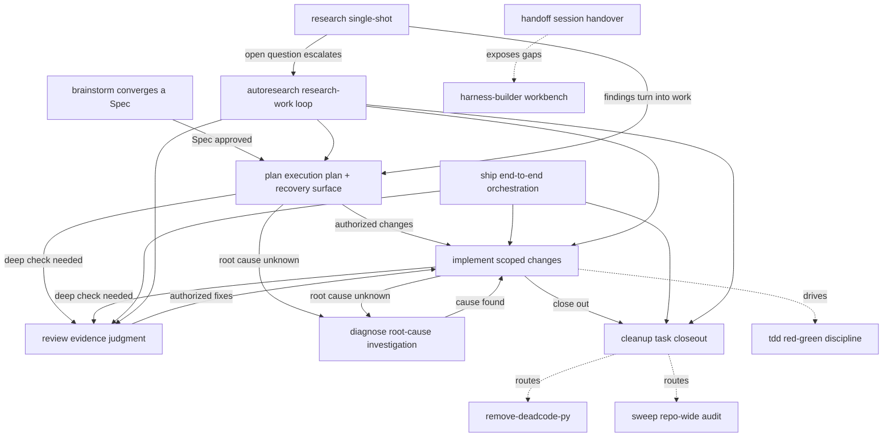

<div align="center">

# Harness Workflow

**Task-scoped workflow skills for coding agents — entry, state, verification, recovery and cleanup discipline.**

[](https://github.com/YSAA1/harness-workflow/actions/workflows/ci.yml)
[](https://github.com/YSAA1/harness-workflow/commits/master)
[](#-skill-map)
[](LICENSE)

[English](README.md) · [简体中文](README.zh-CN.md) · [Repository](https://github.com/YSAA1/harness-workflow)

**Installs to 20+ agents with one command** — and works with any agent that reads the open `SKILL.md` skills format.

</div>

## ⚡ Quick start

```bash
# English tree
npx skills@latest add https://github.com/YSAA1/harness-workflow/tree/master/skills-en

# Chinese tree (default)
npx skills@latest add YSAA1/harness-workflow
```

Verify after install: tell the agent "Use Harness Workflow to plan a scoped implementation", or ask it to list its workflow skills — you should see 9 lanes + 3 helpers + 1 discipline + 4 tools, 17 in total. Language selection, the Claude Code plugin path and manual install live in the [install guide](docs/install.md).

## ✨ Why

Agents fail on process, not intelligence: lost context between sessions, unverified "done" claims, orphaned docs, no recovery path. Harness Workflow turns the [Learn Harness Engineering](docs/harness-method-contract.md) method (C1–C10) into 17 executable skills:

| Principle | Meaning |
| --- | --- |
| 🔎 **Use only what the task needs** | Simple work finishes after focused self-review; complex work adds planning, independent review and durable recovery |
| 🧪 **Fresh evidence over memory** | Ready claims map to actual command output; evidence is reused only while relevant code, config and inputs are unchanged |
| 🔄 **Recovery as a design choice** | One authoritative entry per task/track; `.harness/` only when the work needs it |
| 🧹 **Cleanup is part of the work** | Docs, code leftovers and recovery state are reconciled before handoff, not as optional polish |

## 🧭 Skill map

What each skill does, how to call it, and who calls whom — one graph, one table:



| Skill | What it does | How to call it (say to the agent) | Upstream ← / Downstream → |
| --- | --- | --- | --- |
| brainstorm | Converge a vague idea into an approved Spec | "I want to build X — let's discuss it first" | → plan; → harness-builder |
| plan | Execution plan; minimal recovery surface when needed | "Plan this against the Spec" | ← brainstorm; → implement / review / diagnose |
| implement | Scoped changes, test-driven for behavior | "Implement this plan" | ← plan / ship / review (fix loop-back); drives tdd; → review / diagnose / cleanup |
| diagnose | Evidence-based investigation of unknown failures | "Why is this error happening?" | ← implement / review; → implement |
| review | Review and acceptance-evidence judgment | "Review this diff" | ← plan / implement / ship; → implement (authorized fixes) |
| ship | End-to-end orchestration (implement→review→cleanup) | "This is authorized — take it all the way" | orchestrates implement / review / cleanup |
| cleanup | Task closeout: docs, leftovers, recovery state | "Wrap this up" | ← ship / implement / autoresearch; routes remove-deadcode-py / sweep |
| autoresearch | Research-work loop: investigate, do, adversarially review, distill until done | "Research this open question until answered" | orchestrates plan / implement / review / cleanup; → brainstorm (design trade-offs) |
| harness-builder | Build/fix a project's workbench | "Set up the workbench for this new project" | ← any skill (real gaps); routes find-skills / capability-recommender / writing-for-agents |
| find-skills | Targeted reusable-skill discovery | "Find a skill that can do X" | ← harness-builder / user |
| capability-recommender | Read-only capability selection | "What capability am I missing?" | ← harness-builder / user |
| tdd | Red-first green-second test discipline | Driven by implement at agreed seams | driven by implement |
| remove-deadcode-py | On-demand repo-wide Python dead-code removal | "Clean up the dead code repo-wide" | ← cleanup / user |
| sweep | On-demand repo-wide reconciliation | "Do a full repo audit" | ← cleanup / user |
| research | Lightweight single-shot research (background legwork + primary sources) | "Look up X for me" | → autoresearch (escalation) / plan / implement |
| handoff | Compact the current conversation for the next agent | "Hand off — the next session continues" | → harness-builder (exposed gaps) |
| writing-for-agents | Edit the text agents read | "Change this rule in skill X" | ← user, explicit |

Language versions: skills ship in two trees — Chinese (`skills/`, default) and English (`skills-en/`, a full mirror; harness-builder's tests/ live only in the Chinese tree). Pick a language at install time — see the [install guide](docs/install.md).

New to the set? The [skill guide](docs/skills.md) walks through all 17 skills in plain language: what problem each one solves, what to say to trigger it, the flow it runs, and what you get at the end.

## 🔀 Typical flows

```text
Tiny edit:          implement -> targeted checks + self-review -> done
Authorized task:    ship (= implement -> review -> cleanup)
Unclear feature:    brainstorm -> plan -> harness-builder -> implement -> review -> cleanup
Broken command:     diagnose -> evidence + recommendation (authorized fix -> implement)
Harness audit:      harness-builder -> review -> cleanup
Legacy dead code:   remove-deadcode-py (repo-wide, explicit trigger; task-scoped leftovers belong to cleanup)
Repo-wide audit:    sweep (explicit trigger; runs an inline checklist, no CI gate required in the target project)
Open question:      autoresearch (research → hands-on → review → distill until done)
```

## 📜 Working behavior

- Already-authorized implementation continues after planning; advice-only requests stay read-only.
- Ask about material choices, not routine implementation decisions. Drafts can make a decision reviewable before asking.
- `review` combines findings and fresh evidence; `verify` is only a trigger alias for it. Applicable checks are reused, not rerun merely at stage boundaries.
- `ship` chains implement, review and cleanup for one authorized end-to-end delivery; it adds no extra gate.
- Independent review is risk-driven; project-required independent approval still applies. Missing required evidence remains unknown.
- One authoritative entry per task/track; multiple independent tracks may stay active. An existing tracker is reused instead of adding `.harness/`.
- Reconcile only what this task touched; keep reproduction and acceptance evidence. Zero-drift closeouts may end with no changes.

The full method lives in the [C1–C10 method contract](docs/harness-method-contract.md).

## 🛠 Development and verification

After editing the `skills/` sources, run the structure checks:

```text
node scripts/check-plugin.mjs
bash scripts/agent/check.sh
python3 -B skills/harness-builder/tests/test_scripts.py
```

Structure checks do not replace model-behavior evaluation. No default MCP or hooks are installed. Third-party attributions: THIRD_PARTY_NOTICES.md.

## 📚 Documentation

| Doc | Contents |
| --- | --- |
| [Skill guide](docs/skills.md) | Plain-language walkthrough of all 17 skills |
| [Method contract](docs/harness-method-contract.md) | The stable C1–C10 method |
| [CONTEXT](CONTEXT.md) | Domain terms and boundaries |
| [Install guide](docs/install.md) | skills.sh install, language selection, Claude Code plugin path, manual copy |

## 📄 License

MIT — see [LICENSE](LICENSE).
