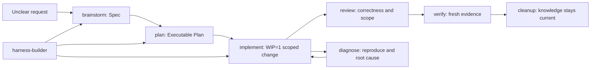

# Harness Workflow

[简体中文](README.zh-CN.md)

<p align="center">
  
</p>


`harness-workflow` packages the Learn Harness Engineering operating model as reusable workflow instructions for AI coding agents. It gives an agent a practical workbench: project entry points, scoped planning, fresh verification, recovery surfaces, and cleanup discipline.

The repository supports three agent surfaces:

| Surface | Runtime shape | Primary entry | Recognition target |
| --- | --- | --- | --- |
| Codex | Global plugin marketplace + skills | `.agents/plugins/marketplace.json` + `.codex-plugin/plugin.json` | Plugin `harness-workflow` and 8 bundled skills |
| Claude Code | Global plugin marketplace + personal-skill fallback | `.claude-plugin/marketplace.json` + `.claude-plugin/plugin.json` | `/harness-workflow:skill-name` or personal `/skill-name` |
| Cursor | Cursor plugin + project adapter | `.cursor-plugin/plugin.json`, `skills/`, `rules/`, `.cursor/rules/*.mdc` | `/add-plugin harness-workflow` or copied Project Rules |

Codex and Claude Code are installed globally through their plugin marketplace flows. Cursor is supported through Cursor's plugin shape when published, with a project adapter that copies rules and skills into a target repo when marketplace install is not available.

## Why This Exists

Most agent failures are not model failures alone. They come from missing project maps, unclear scope, weak verification, invisible state, and stale documentation. Harness Workflow turns those concerns into small reusable workflows instead of one giant prompt.



## Quick Install

### Codex

Install the plugin globally through the Codex marketplace flow:

```bash
codex plugin marketplace add <owner>/<repo>
```

Then install `harness-workflow` from the Codex plugin directory. Successful recognition means Codex sees plugin `harness-workflow` and the 8 active skills listed below. See [docs/install/codex.md](docs/install/codex.md).

### Claude Code

Install globally from a Claude Code plugin marketplace:

```bash
claude plugin marketplace add <owner>/<repo>
claude plugin install harness-workflow@harness-workflow
```

Then invoke namespaced skills:

```text
/harness-workflow:harness-builder
```

Claude Code personal skills in `~/.claude/skills/` are documented only as a user-level fallback, not as this repo's primary install path. See [docs/install/claude-code.md](docs/install/claude-code.md).

### Cursor

For Cursor marketplace usage after publication:

```text
/add-plugin harness-workflow
```

For project-local installation into a target repo, copy the Cursor rules and canonical skills:

```bash
node scripts/install-cursor.mjs --target /path/to/target-project
node scripts/check-cursor-install.mjs
```

Cursor support does not use the Codex manifest. The project adapter installs `.cursor/rules/` and `.cursor/skills/` into the target repo and intentionally avoids legacy `.cursorrules`. See [docs/install/cursor.md](docs/install/cursor.md).

## Workflow Skills

| Skill | Use When | Output |
| --- | --- | --- |
| `harness-builder` | The project workbench, verification entry, Capability Discovery, or recovery surface is unclear | Harness Hypothesis and project-local harness plan |
| `brainstorm` | The requirement is fuzzy or has multiple valid interpretations | Approved Spec |
| `plan` | A Spec is approved or the request is already clear | Executable Plan |
| `implement` | The next scoped change is ready to build | Minimal verified code/doc change |
| `diagnose` | A failure, regression, or unknown root cause blocks progress | Reproduction, root cause, minimal fix, evidence |
| `review` | A change needs correctness, scope, design, and test scrutiny | Findings and residual risk |
| `verify` | A ready claim needs proof | Fresh evidence for a specific claim |
| `cleanup` | Work is done and project knowledge may drift | Updated docs, generated artifacts, and handoff notes |

`state-contract`, `resume`, and `save-session` are not active skills. Their useful ideas live in Harness Builder recovery policy and Cleanup handoff hygiene.

## Recovery Surface

A recovery surface is the durable place future agents use instead of chat history. It is semantic, not tied to one file layout.

| Backend | Use For | Typical Artifacts |
| --- | --- | --- |
| `none` | Simple one-turn work | Current request and git diff |
| `lightweight` | Small tasks needing only scope and evidence | Existing docs or short notes |
| `three-file` | Multi-step, risky, or cross-session work | `task_plan.md`, `progress.md`, `findings.md` |
| `feature-list` | Many independent product features | Feature tracker or structured list |
| `existing` | Repos with their own tracker | Issues, roadmap, project docs, internal system |

All skills read the same semantic fields when available: `active_slice`, `non_goals`, `success_criteria`, `verification_path`, `evidence_log`, `decisions`, `risks`, `blockers`, and `next_actions`.

## Method Contract

| Contract | Meaning | Primary skills |
| --- | --- | --- |
| C1 Harness as system | Agent performance comes from surrounding systems, not prompts alone | `harness-builder`, `diagnose` |
| C2 Repository as truth | Repository artifacts and recovery surface are the durable truth | All skills |
| C3 Thin instruction surface | `AGENTS.md` stays a thin rule entry | `harness-builder`, `cleanup` |
| C4 Workbench before implementation | Project map, verification entry, and recovery path must be clear when needed | `harness-builder` |
| C5 Scoped work | Work is bounded by Spec, Executable Plan, and WIP=1 | `brainstorm`, `plan`, `implement` |
| C6 Fresh evidence | Ready claims require current evidence | `review`, `verify`, `diagnose` |
| C7 Capability fit | Add skills, MCP, hooks, or subagents only when value beats risk | `harness-builder`, `verify` |
| C8 Artifact freshness | Docs, commands, and generated files must match code | `review`, `cleanup` |
| C9 Knowledge Cleanup | Close work by reducing drift and entropy | `cleanup` |
| C10 Backend decoupling | Recovery surface is semantic; three-file is optional | `harness-builder`, all skills |

## Validation

Run the full repository-side recognition checks before publishing:

```bash
node scripts/check-plugin.mjs
node scripts/check-claude-code-install.mjs
node scripts/check-cursor-install.mjs
```

If you modify skill structure or the generated flow review:

```bash
node scripts/generate-skill-flow-html.mjs
node scripts/check-plugin.mjs
```

`docs/skill-flow-review/*.html` is generated. Update the generator, then rebuild.

## Repository Map

| Path | Purpose |
| --- | --- |
| `.agents/plugins/marketplace.json` | Codex marketplace entry for global plugin install |
| `.codex-plugin/plugin.json` | Codex plugin metadata and default prompts |
| `.claude-plugin/marketplace.json` | Claude Code marketplace entry for global plugin install |
| `.claude-plugin/plugin.json` | Claude Code plugin metadata |
| `.cursor-plugin/plugin.json` | Cursor plugin metadata |
| `rules/` | Cursor plugin rules |
| `.cursor/rules/` | Cursor Project Rules source for project adapter installs |
| `skills/*/SKILL.md` | Canonical workflow skill source |
| `skills/*/references/` | Detailed policy and checklist files |
| `skills/plan/templates/` | Optional three-file backend templates |
| `docs/install/` | Per-surface installation and recognition guides |
| `docs/harness-method-contract.md` | C1-C10 method contract |
| `docs/skill-flow-review/` | Generated skill flow review HTML |
| `scripts/check-*.mjs` | Repository-side recognition and consistency checks |

## Publishing Checklist

1. Run all validation commands.
2. Confirm the README and install docs describe the same three surfaces.
3. Confirm no default MCP, hooks, user-level config, or hidden install side effects were added.
4. Create a public GitHub repository and push.
5. Perform live recognition where available: Codex plugin listing, Claude Code plugin/skill list, Cursor plugin search or Project Rules UI.

## License

MIT.
