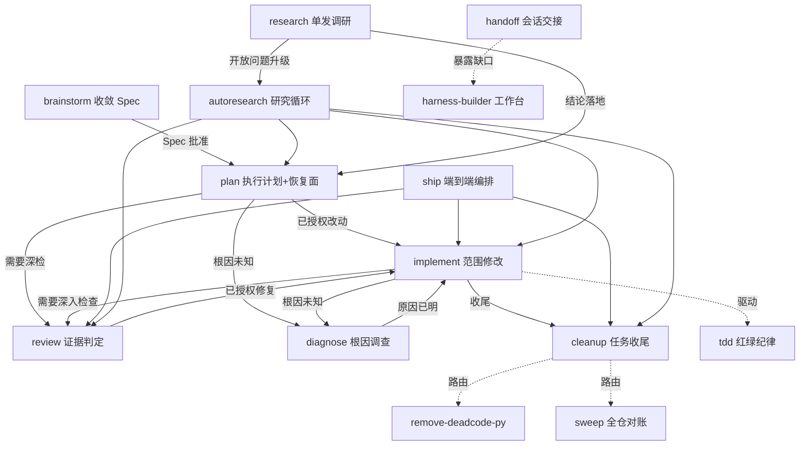

<div align="center">

# Harness Workflow

**面向编码 agent 的任务级工作流技能 —— 入口、状态、验证、恢复与收尾纪律。**

[](https://github.com/YSAA1/harness-workflow/actions/workflows/ci.yml)
[](LICENSE)

[English](README.md) · [简体中文](README.zh-CN.md) · [项目仓库](https://github.com/YSAA1/harness-workflow)

**一条命令装进 20+ agent** —— 兼容任何读取开放 `SKILL.md` 技能格式的 agent。

</div>

## 为什么需要

agent 的失败多数在流程而非智力：跨会话丢上下文、未验证就宣称"完成"、文档失修、没有恢复路径。本仓库把 [Learn Harness Engineering](docs/harness-method-contract.md) 方法（C1–C10）落成一组可执行技能：

- **按任务需要取用** —— 小任务自审加针对性检查直接完成；复杂任务再引入规划、独立审查和持久恢复。
- **新证据优先于记忆** —— 完成声明对应真实命令输出；相关代码、配置和输入未变时复用既有证据。
- **恢复是一种设计选择** —— 每条任务/轨道一个权威入口；工作确实需要时才建 `.harness/`。
- **收尾是工作的一部分** —— 交付前对齐文档、代码遗留和恢复状态，不是可选的美化。


## 安装

一条命令，交互选择目标 agent 与要装的技能（基于 [skills.sh](https://skills.sh)）：

```bash
npx skills@latest add YSAA1/harness-workflow
```

- 支持 20+ agent：Claude Code、Cursor、Codex、GitHub Copilot、Gemini CLI、OpenCode、Goose、Windsurf、Cline、AMP、Roo、Trae、VS Code、Zed 等。
- 整套装或只挑几个技能（例如只装 `review` + `cleanup`）；项目级、用户级均可。
- 更新用 `npx skills update`，不做任何背后的自动变更。
- 注意：`implement`、`tdd`、`writing-for-agents` 与其他流行套件（如 mattpocock/skills）同名，装进同一 agent 的技能目录会互相顶位——详见[安装指南](docs/install.md)的混装警示。

Claude Code 也可以走托管插件：

```text
/plugin marketplace add YSAA1/harness-workflow
/plugin install harness-workflow@harness-workflow
```

未列入 skills.sh 的 CLI（Grok Build、ZCode、Kimi Code）读取同一开放格式：把 `skills/<name>` 拷入 `~/.agents/skills/` 或对应 CLI 的技能目录。完整指南见[安装指南](docs/install.md)。

## 工作流

| 技能 | 用途 |
| --- | --- |
| brainstorm | 重要设计取舍与聚焦 Spec |
| plan | 执行依赖与必要持久计划 |
| implement | 范围内修改，行为改动在商定 seams 测试驱动，按风险验证 |
| diagnose | 根因未知的故障调查 |
| review | 审阅、风险与验收证据（`verify` 是它的触发词别名） |
| ship | 串联 implement、review、cleanup 的端到端交付 |
| cleanup | 本任务知识收尾（文档 + 代码遗留），包括阻塞交接 |
| autoresearch | 研究循环总控：假设轮次 + 直接取证 + 对抗验证 + 排除法重开 + 诚实终态，预算与授权档位可调 |
| harness-builder | 在目标项目搭/修工作台：入口指针、恢复面、验证闸门（首次接入或真缺口才用；日常任务不经过） |
| find-skills | 明确技能缺口的定向发现 |
| capability-recommender | 只读能力选型 |
| tdd | 先红后绿的测试纪律，由 implement 在商定 seams 驱动 |
| writing-for-agents | 改「给 agent 读的文字」：写/改 skill、审计修订持久指令、修复迁移恢复面（搭工作台本身用 harness-builder） |
| remove-deadcode-py | 按需全仓 Python 死代码清除（vulture/Ruff 检测 + 证据定罪 + 分批原子删除） |
| sweep | 按需全仓对账（六档盘点 + 证据定罪 + 用户裁决） |
| research | 轻量单发调研：后台跑腿、一手来源、结论带出处落 `docs/research/`（工具 skill） |
| handoff | 会话交接：压缩当前会话给下一个 agent，有恢复面优先写 state（工具 skill） |

典型路径：

```text
小修改：        implement -> 针对性检查 + 自审 -> 完成
已授权任务：    ship（= implement -> review -> cleanup）
不清晰的功能：  brainstorm -> plan -> harness-builder -> implement -> review -> cleanup
命令坏了：      diagnose -> 证据与建议（授权修复 -> implement）
harness 审计：  harness-builder -> review -> cleanup
存量死代码：    remove-deadcode-py（全仓，显式触发；任务内遗留归 cleanup）
全仓对账：      sweep（显式触发；内联清单执行，目标项目无需 CI 闸门）
开放问题：      autoresearch（假设轮次、对抗审查、诚实终态）
```

## 技能地图：谁干什么、怎么叫、谁调用谁

### 调用关系图



### 逐技能用法与上下游

| 技能 | 干什么 | 怎么用（对 agent 说） | 上游 ← / 下游 → |
| --- | --- | --- | --- |
| brainstorm | 把模糊想法收敛成批准的 Spec | 「我想做个 X，先讨论清楚再动手」 | → plan；→ harness-builder |
| plan | 执行计划，必要时建最小恢复面 | 「按这个 Spec 排个计划」 | ← brainstorm；→ implement / review / diagnose |
| implement | 范围内修改，行为改动测试驱动 | 「实现这个计划」 | ← plan / ship / review（修复回边）；驱动 tdd；→ review / diagnose / cleanup |
| diagnose | 根因未知的证据化调查 | 「这个报错为什么发生」 | ← implement / review；→ implement |
| review | 审查与验收证据判定 | 「审一下这个 diff」 | ← plan / implement / ship；→ implement（已授权修复） |
| ship | 端到端编排（implement→review→cleanup） | 「这活授权了，干到底」 | 编排 implement / review / cleanup |
| cleanup | 任务收尾：文档、遗留、恢复状态 | 「收尾」 | ← ship / implement / autoresearch；路由 remove-deadcode-py / sweep |
| autoresearch | 研究循环总控（假设轮+对抗+诚实终态） | 「研究这个开放问题」 | 编排 plan / implement / review / cleanup；→ brainstorm（设计取舍） |
| harness-builder | 在目标项目搭/修工作台 | 「新项目把工作台搭起来」 | ← 任意（真缺口）；路由 find-skills / capability-recommender / writing-for-agents |
| find-skills | 定向发现可复用技能 | 「找个能干 X 的技能」 | ← harness-builder / 用户 |
| capability-recommender | 只读能力选型推荐 | 「我缺什么能力」 | ← harness-builder / 用户 |
| tdd | 先红后绿的测试纪律 | 由 implement 在商定 seams 驱动 | 被 implement 驱动 |
| remove-deadcode-py | 按需全仓 Python 死代码清理 | 「清理全仓死代码」 | ← cleanup / 用户 |
| sweep | 按需全仓对账 | 「大扫除 / 盘点」 | ← cleanup / 用户 |
| research | 轻量单发调研（后台跑腿+一手来源） | 「帮我查一下 X」 | → autoresearch（升级）/ plan / implement |
| handoff | 把当前会话压缩交接给下一个 agent | 「交接，下个会话继续」 | → harness-builder（暴露缺口） |
| writing-for-agents | 改「给 agent 读的文字」 | 「改一下 XX skill 的这条规则」 | ← 用户显式 |

语言版本：技能有中文（`skills/`，默认）与英文（`skills-en/`，完整镜像；harness-builder 的 tests/ 仅在中文树）两棵树，安装时可选——见[安装指南](docs/install.md)。

## 工作约定

- 明确授权执行时，计划后继续；只要审计或建议时保持只读。只问影响结果的重要选择。
- 重大取舍可以先用草稿落地再询问：把决定做成可审阅的草稿，比空口讨论更省一轮。
- `review` 合并审查与证据判断；`verify` 仅是它的触发词别名，不重复运行一套测试。
- `ship` 将 implement、review、cleanup 串成一次已授权任务的端到端交付，不额外加闸门。
- 复用仍适用的真实证据，相关代码、环境或输入改变后再补查。必要验收未知时不宣称完成。
- 每条任务/轨道一个权威入口，允许多个独立任务 active；已有 tracker 不必新增 `.harness/`。
- 仅整理本次影响的文档与代码遗留，保留复现与验收证据；没有漂移可以零修改结束。

完整方法见 [C1–C10 方法合同](docs/harness-method-contract.md)。

## 开发与验证

编辑 `skills/` 源码后运行结构验证：

```text
node scripts/check-plugin.mjs
bash scripts/agent/check.sh
python -B skills/harness-builder/tests/test_scripts.py
```

结构检查不替代模型行为效果评测；不安装默认 MCP 或 hooks。第三方归属见 THIRD_PARTY_NOTICES.md。

## 文档

| 文档 | 内容 |
| --- | --- |
| [方法合同](docs/harness-method-contract.md) | 稳定的 C1–C10 方法 |
| [CONTEXT](CONTEXT.md) | 领域术语与边界 |
| [安装指南](docs/install.md) | skills.sh 安装、Claude Code 插件路径、手动拷贝 |

## 许可

MIT —— 见 [LICENSE](LICENSE)。
