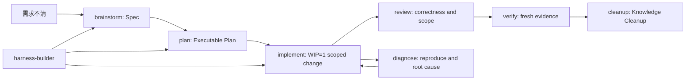

# Harness Workflow

[English](README.md)

<p align="center">
  
</p>


`harness-workflow` 把 Learn Harness Engineering 的工作方式打包成一组可复用的 AI 编程 agent workflow。它不是一个大提示词，而是一套项目工作台：项目入口、范围控制、可执行计划、fresh evidence、恢复面和知识收尾纪律。

本仓库支持三条使用线：

| 端 | 运行形态 | 主入口 | 识别目标 |
| --- | --- | --- | --- |
| Codex | 全局 plugin marketplace + skills | `.agents/plugins/marketplace.json` + `.codex-plugin/plugin.json` | 插件 `harness-workflow` 和 8 个 bundled skills |
| Claude Code | 全局 plugin marketplace + personal skills fallback | `.claude-plugin/marketplace.json` + `.claude-plugin/plugin.json` | `/harness-workflow:skill-name` 或 personal `/skill-name` |
| Cursor | Cursor plugin + project adapter | `.cursor-plugin/plugin.json`、`skills/`、`rules/`、`.cursor/rules/*.mdc` | `/add-plugin harness-workflow` 或复制后的 Project Rules |

Codex 和 Claude Code 主路径都是全局 plugin marketplace 安装。Cursor 发布后走 Cursor plugin 形态；marketplace 不可用时，用项目适配脚本把 rules 和 skills 复制到目标项目。

## 为什么需要它

很多 agent 工作失败不是模型单点能力不足，而是项目地图缺失、范围不清、验证不硬、状态不可恢复、文档腐化。Harness Workflow 把这些工程约束拆成小而稳定的 workflow。



## 快速安装

### Codex

通过 Codex marketplace flow 全局安装：

```bash
codex plugin marketplace add <owner>/<repo>
```

然后在 Codex plugin directory 中安装 `harness-workflow`。成功识别意味着 Codex 能看到插件 `harness-workflow` 和下方 8 个 active skills。详见 [docs/install/codex.md](docs/install/codex.md)。

### Claude Code

从 Claude Code plugin marketplace 全局安装：

```bash
claude plugin marketplace add <owner>/<repo>
claude plugin install harness-workflow@harness-workflow
```

然后调用 namespaced skills：

```text
/harness-workflow:harness-builder
```

`~/.claude/skills/` personal skills 只作为用户级 fallback，不是本仓库主安装路径。详见 [docs/install/claude-code.md](docs/install/claude-code.md)。

### Cursor

发布到 Cursor marketplace 后：

```text
/add-plugin harness-workflow
```

项目本地安装时，把 Cursor rules 和 canonical skills 复制到目标仓库：

```bash
node scripts/install-cursor.mjs --target /path/to/target-project
node scripts/check-cursor-install.mjs
```

Cursor 支持不读取 Codex manifest。项目适配脚本会安装 `.cursor/rules/` 和 `.cursor/skills/`，并且不使用 legacy `.cursorrules`。详见 [docs/install/cursor.md](docs/install/cursor.md)。

## Workflow Skills

| Skill | 什么时候用 | 产物 |
| --- | --- | --- |
| `harness-builder` | 项目工作台、验证入口、Capability Discovery 或 recovery surface 不清楚 | Harness Hypothesis 和项目本地 harness plan |
| `brainstorm` | 需求模糊或有多个合理解释 | 已批准的 Spec |
| `plan` | Spec 已批准，或请求已经足够明确 | Executable Plan |
| `implement` | 下一个 scoped change 可以开始实现 | 最小且经过验证的代码/文档改动 |
| `diagnose` | 失败、回归或未知 root cause 阻塞进展 | 复现、根因、最小修复和证据 |
| `review` | 改动需要正确性、范围、设计和测试审查 | Findings 和剩余风险 |
| `verify` | ready claim 需要证明 | 面向具体 claim 的 fresh evidence |
| `cleanup` | 工作完成后需要防止项目知识漂移 | 更新后的 docs、生成物和交接记录 |

`state-contract`、`resume`、`save-session` 不再是 active skills。它们有价值的思想已经迁入 Harness Builder recovery policy 和 Cleanup handoff hygiene。

## Recovery Surface

Recovery surface 是未来 agent 不依赖聊天记录也能恢复工作的项目工件。它是语义 contract，不绑定某一种文件布局。

| Backend | 适用场景 | 常见工件 |
| --- | --- | --- |
| `none` | 简单一次性任务 | 当前请求和 git diff |
| `lightweight` | 只需要范围和关键证据的小任务 | 既有 docs 或短记录 |
| `three-file` | 多步、高风险、跨会话工作 | `task_plan.md`、`progress.md`、`findings.md` |
| `feature-list` | 多个独立产品 feature | feature tracker 或结构化列表 |
| `existing` | 已有任务系统的仓库 | Issues、roadmap、项目 docs、内部系统 |

所有 skills 在可用时读取同一组语义字段：`active_slice`、`non_goals`、`success_criteria`、`verification_path`、`evidence_log`、`decisions`、`risks`、`blockers`、`next_actions`。

## Method Contract

| Contract | 含义 | 主要 skills |
| --- | --- | --- |
| C1 Harness as system | agent 表现来自周边系统，不只是 prompt | `harness-builder`, `diagnose` |
| C2 Repository as truth | 仓库工件和 recovery surface 是持久真相 | all skills |
| C3 Thin instruction surface | `AGENTS.md` 保持薄规则入口 | `harness-builder`, `cleanup` |
| C4 Workbench before implementation | 需要时先确认项目地图、验证入口和恢复路径 | `harness-builder` |
| C5 Scoped work | 工作受 Spec、Executable Plan 和 WIP=1 约束 | `brainstorm`, `plan`, `implement` |
| C6 Fresh evidence | ready claim 必须有当前证据 | `review`, `verify`, `diagnose` |
| C7 Capability fit | skills、MCP、hooks、subagents 只有价值大于成本才添加 | `harness-builder`, `verify` |
| C8 Artifact freshness | docs、命令和生成物必须匹配代码 | `review`, `cleanup` |
| C9 Knowledge Cleanup | 收尾时降低漂移和熵 | `cleanup` |
| C10 Backend decoupling | recovery surface 是语义层，three-file 只是可选 backend | `harness-builder`, all skills |

## 验证

发布前运行三端仓库侧识别检查：

```bash
node scripts/check-plugin.mjs
node scripts/check-claude-code-install.mjs
node scripts/check-cursor-install.mjs
```

如果修改了 skill 结构或 flow review 生成逻辑：

```bash
node scripts/generate-skill-flow-html.mjs
node scripts/check-plugin.mjs
```

`docs/skill-flow-review/*.html` 是生成物。应修改生成脚本后重新生成，不要手改。

## 仓库地图

| 路径 | 作用 |
| --- | --- |
| `.agents/plugins/marketplace.json` | Codex 全局 plugin 安装的 marketplace entry |
| `.codex-plugin/plugin.json` | Codex plugin metadata 和 default prompts |
| `.claude-plugin/marketplace.json` | Claude Code 全局 plugin 安装的 marketplace entry |
| `.claude-plugin/plugin.json` | Claude Code plugin metadata |
| `.cursor-plugin/plugin.json` | Cursor plugin metadata |
| `rules/` | Cursor plugin rules |
| `.cursor/rules/` | Cursor project adapter 的 Project Rules source |
| `skills/*/SKILL.md` | canonical workflow skill source |
| `skills/*/references/` | 细节 policy 和 checklist |
| `skills/plan/templates/` | 可选 three-file backend 模板 |
| `docs/install/` | 三端安装和识别文档 |
| `docs/harness-method-contract.md` | C1-C10 方法契约 |
| `docs/skill-flow-review/` | 生成的 skill flow review HTML |
| `scripts/check-*.mjs` | 仓库侧识别和一致性检查 |

## 发布检查表

1. 运行所有验证命令。
2. 确认 README 和 install docs 对三端的描述一致。
3. 确认没有默认 MCP、hooks、用户级配置或隐藏安装副作用。
4. 创建公开 GitHub 仓库并 push。
5. 在可用环境中做 live recognition：Codex plugin list、Claude Code plugin/skill list、Cursor plugin search 或 Project Rules UI。

## License

MIT.
