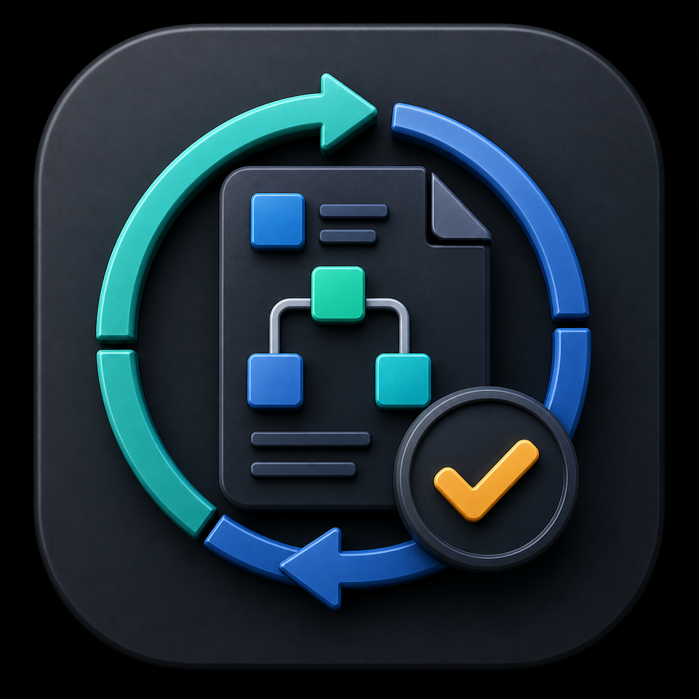
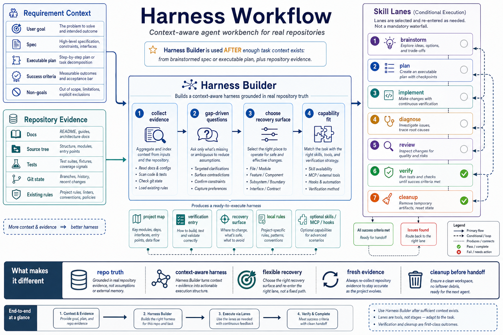
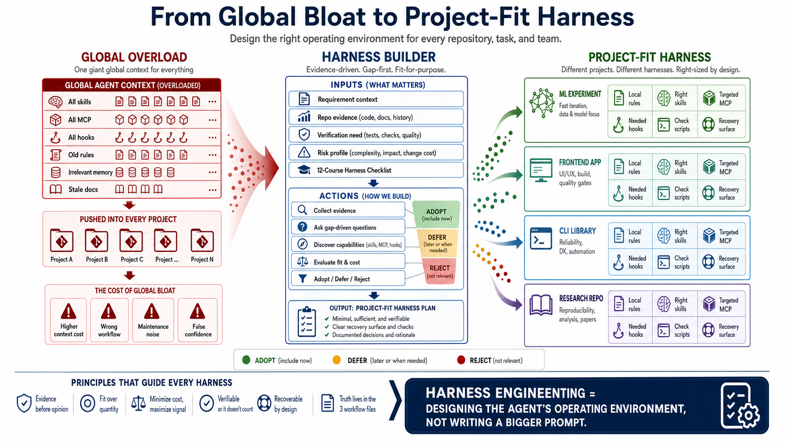

[English](README.md)

<p align="center">
  
</p>

<h1 align="center">Harness Workflow</h1>

<p align="center">
  <strong>给真实仓库使用的上下文感知 agent 工作台。</strong>
</p>

<p align="center">
  让 Codex、Claude Code 和 Cursor 在开工前拿到足够的需求上下文、仓库证据、恢复状态和验证纪律，适合那些不能靠一轮聊天做完的项目。
</p>

<p align="center">
  <a href="https://github.com/YSAA1/harness-workflow/actions/workflows/ci.yml"></a>
</p>

<p align="center">
  <a href="#快速开始">快速开始</a> ·
  <a href="#为什么需要它">为什么需要</a> ·
  <a href="#它和普通-workflow-有什么不同">特点</a> ·
  <a href="#skill-map">Skill map</a> ·
  <a href="docs/install/codex.md">Codex</a> ·
  <a href="docs/install/claude-code.md">Claude Code</a> ·
  <a href="docs/install/cursor.md">Cursor</a>
</p>

<p align="center">
  
</p>

> 上下文越充分、仓库证据越真实，harness 才越有用。`harness-builder` 通常应该放在 `brainstorm` 或 `plan` 之后，因为那时 agent 才知道要做什么、不能做什么、以及应该如何证明做对。

<p align="center">
  
</p>

## 快速开始

安装插件，然后按当前项目状态进入对应 lane。

```bash
codex plugin marketplace add YSAA1/harness-workflow
```

Claude Code:

```bash
claude plugin marketplace add YSAA1/harness-workflow
claude plugin install harness-workflow@harness-workflow
```

Cursor project-local 用法：

```bash
node scripts/install-cursor.mjs --target .
node scripts/check-cursor-install.mjs
```

这个 adapter 会安装 `.cursor/rules/` 和 `.cursor/skills/`；本仓库也把同一套 Cursor 预览面提交进来，包括 `find-skills`。它不依赖 legacy `.cursorrules`。详见 [docs/install/cursor.md](docs/install/cursor.md)。

## 为什么需要它

很多开源 agent workflow 会给一条漂亮顺序：收集需求、写计划、改代码、review、verify。这条顺序有用，但它经常把真正难的部分留空。

真实仓库里会有过期文档、缺失测试、不清楚的 owner、dirty git state、本地约定、跑不起来的安装命令，以及跨 context compaction 的长任务。一个通用 checklist 没法判断这个仓库应该用什么恢复面、什么验证入口、什么 skill、什么 hook、什么 MCP。

Harness Workflow 解决的就是这个缺口。它把思考、计划、实现、诊断、验证、收尾和项目 harness 构建拆成不同 lane。重点不是把每个任务都变重，而是让流程贴合真实证据。

## 它解决哪些痛点

Harness engineering 听起来容易抽象：给 agent 设计更好的运行环境。真正难的是把这个理念落成文件、检查命令、规则、恢复状态和能力选择，让下一次开发真的更稳。

最常见的问题有三个：

| 痛点 | 常见结果 | 这个插件怎么处理 |
| --- | --- | --- |
| "Harness engineering" 停留在理念层 | 大家觉得方向对，但不知道第一步该创建什么。 | `harness-builder` 把理念落成具体工件：项目地图、薄规则、检查脚本、恢复面、能力决策和 cleanup policy。 |
| 所有项目吃同一套全局配置 | 用户把所有 skills、MCP、hooks、memories、rules 都装到全局。上下文变吵，工具互相干扰，小项目继承无关流程。 | 插件强调 project-fit：当前仓库需要什么就 adopt，暂时有用但不急就 defer，增加成本但没有信号就 reject。 |
| agent 做完但留下熵 | 测试可能过了，但 README 过期、临时文件残留、状态不准，下个 agent 还要重新摸索。 | `verify` 要求 fresh evidence，`cleanup` 对齐 README、生成物、恢复状态和交接知识。 |

## Harness engineering 怎么落地

harness 不是一个更长的 prompt。它是围绕模型的一套项目运行环境：

- **Instructions**：薄 `AGENTS.md` 或 `CLAUDE.md`、项目铁律、保护路径、按任务类型的必读入口。
- **State**：none、lightweight note、three-file backend、feature list、issue tracker，或项目已有系统。
- **Feedback**：快速检查、smoke test、tiny run、截图、日志和当前验证证据。
- **Tools**：脚本、项目级 skills、定向 MCP、经过理由筛选的 hooks，以及真的能降低缺口的 subagents。
- **Cleanup**：防腐化规则，确保每个 session 结束时 docs、状态和残留物不会误导下一位 agent。

[`course_alignment.md`](skills/harness-builder/references/course_alignment.md) 里的 12 节课思想已经融入 `harness-builder`，作为实际 coverage checklist。它会追问：强模型在这里还会怎样失败；模型周围需要哪些系统；哪些规则必须进入仓库真相；根 `AGENTS.md` 如何保持薄；长任务是否需要连续性；新 agent 开工前要做什么；如何限制范围；是否需要 feature list；怎样防止过早宣布完成；哪些地方需要 smoke/e2e/tiny-run；执行过程要捕获什么证据；每次会话结束应留下怎样的 clean state。

这不是强制产物清单，而是决策框架。一个小 CLI 库可能只需要项目地图和一条 check command。一个 ML 实验仓库可能需要 tiny-run 验证、data leakage review、run metadata 和更严格的恢复状态。一个前端项目可能需要浏览器 smoke check 和设计 review。不同项目就应该有不同 harness。

## 它和普通 workflow 有什么不同

| 特点 | 实际含义 |
| --- | --- |
| 上下文感知地构建 harness | `harness-builder` 在有条件时应该读取 brainstorm 后的 spec 或可执行 plan，再结合真实仓库证据。它不是空泛模板生成器。 |
| 先看 repo truth，再谈流程 | agent 会检查 docs、源码布局、测试、git 状态、已有规则和 setup 命令，再判断项目是否真的 ready。 |
| 恢复面是设计决策 | 有些任务不需要持久状态；有些只要短 checkpoint；有些需要 `task_plan.md`、`progress.md`、`findings.md`；有些应该复用 issue tracker 或已有 docs。 |
| 能力必须匹配真实缺口 | 额外 skills、MCP、hooks、subagents 只有在补上当前任务或仓库缺口时才推荐。插件内置的 `find-skills` 辅助 skill 用于 skill 发现；hooks、MCP 和工具行为优先查当前官方资料或成熟实现。 |
| ready claim 必须有新证据 | `verify` 会把每个“完成了”的声明绑定到当前证据：测试、构建输出、smoke check、截图、人工检查，或明确说明为什么无法验证。 |
| cleanup 是交付的一部分 | README 过期、生成物残留、状态不清、恢复笔记缺失，都不是小问题。下一个 agent 读不懂现场，工作就没有真正结束。 |

## `harness-builder` 应该放在哪里

`harness-builder` 负责创建或修复项目工作台：`AGENTS.md` 或 `CLAUDE.md`、项目地图、验证入口、恢复面、本地规则，以及经过理由筛选的可选能力。

推荐顺序：

| 项目状态 | 更合适的路径 |
| --- | --- |
| 需求还模糊，方案还有取舍 | `brainstorm -> plan -> harness-builder -> implement` |
| 需求已经清楚，但仓库工作台缺失 | `plan -> harness-builder -> implement` |
| 仓库已经有 fresh harness 和明确 check path | 跳过 `harness-builder`，进入 `implement`、`diagnose` 或 `verify` |
| 任务本身就是审计、修复或创建 agent governance | 直接用 `harness-builder`，但仍然先收集证据并做 gap-driven questions |
| 只是很小的改动 | 直接做并验证，不要制造流程 |

这个顺序很重要。一个有用的 harness 取决于当前目标、non-goals、风险、验证策略和仓库形状。没有这些上下文，agent 只能装一套看起来合理的模板。

## Skill map

| Skill | 什么时候用 | 应该留下什么 |
| --- | --- | --- |
| `brainstorm` | 目标、边界、取舍或成功标准还不够清楚。 | 聚焦的 spec：goals、non-goals、考虑过的方案、成功标准和验证策略。 |
| `plan` | spec 或用户请求已经清楚，可以选择第一个可执行 slice。 | 写入 selected planning surface 的计划，包括 active slice、proof path 和 commit-sized work units。 |
| `harness-builder` | 仓库缺少可靠工作台、恢复面、验证入口或能力决策。 | 基于仓库证据的最小 project-local harness plan，以及经过批准安装的组件。 |
| `implement` | 一个 slice 已经 ready，项目工作面也足够清楚。 | 小范围改动，以及本地检查证据；如果检查不能跑，要说明原因。 |
| `diagnose` | build、test、lint、typecheck、CI 或运行时行为失败，且根因未知。 | 复现、一个已验证假设、根因、最小修复和回归证据。 |
| `review` | 有意义的改动已经稳定，需要在 ready 前检查。 | 关于正确性、测试缺口、文档漂移、范围膨胀和残余风险的 findings。 |
| `verify` | agent 准备声明 work ready。 | 绑定具体成功标准的 fresh evidence。 |
| `cleanup` | 工作完成、阻塞、放弃或准备交接。 | 更新后的项目知识、清理后的残留物，以及下个 agent 能读的恢复状态。 |
| `find-skills` | 当前任务可能受益于已有可复用 skill。 | 搜索候选 skill，并在推荐或安装前检查质量。 |

## 常见路径

```text
Tiny edit:
implement -> verify

Unclear feature:
brainstorm -> plan -> harness-builder -> implement -> review -> verify -> cleanup

Clear task in an unfamiliar repo:
plan -> harness-builder -> implement -> review -> verify

Broken command:
diagnose -> implement -> verify

Harness audit or repair:
harness-builder -> verify -> cleanup
```

这些 lanes 可以循环。如果 verify 发现缺浏览器 runner、外部 API、本地 skill 或 recovery gap，就把这个缺口交回 `harness-builder`，不要塞在实现里糊过去。

## 安装

### Codex

```bash
codex plugin marketplace add YSAA1/harness-workflow
```

然后在 Codex plugin directory 中安装 `harness-workflow`。维护本仓库时运行：

```bash
node scripts/check-plugin.mjs
```

详见 [docs/install/codex.md](docs/install/codex.md)。

### Claude Code

```bash
claude plugin marketplace add YSAA1/harness-workflow
claude plugin install harness-workflow@harness-workflow
```

调用 namespaced command：

```text
/harness-workflow:harness-builder
```

详见 [docs/install/claude-code.md](docs/install/claude-code.md)。

### Cursor

Cursor plugin 安装可用时：

```text
/add-plugin harness-workflow
```

如果要把 rules 和 skills 复制到当前项目：

```bash
node scripts/install-cursor.mjs --target .
node scripts/check-cursor-install.mjs
```

详见 [docs/install/cursor.md](docs/install/cursor.md)。

## 检查本仓库

```bash
node scripts/check-plugin.mjs
node scripts/check-claude-code-install.mjs
node scripts/check-cursor-install.mjs
claude plugin validate .
```

## 项目结构

| 路径 | 用途 |
| --- | --- |
| `skills/*/SKILL.md` | canonical workflow skill source。 |
| `skills/*/references/` | 按需读取的 checklist 和 policy notes。 |
| `.codex-plugin/` | Codex plugin metadata。 |
| `.claude-plugin/` | Claude Code plugin metadata 和 marketplace entry。 |
| `.cursor-plugin/`, `rules/`, `.cursor/rules/` | Cursor plugin 和 project-rule adapter surface。 |
| `docs/assets/readme/` | README icon 和 imagegen infographic PNG assets。 |
| `docs/install/` | 各端安装说明。 |
| `scripts/check-*.mjs` | 一致性和识别检查。 |

## License

MIT.
