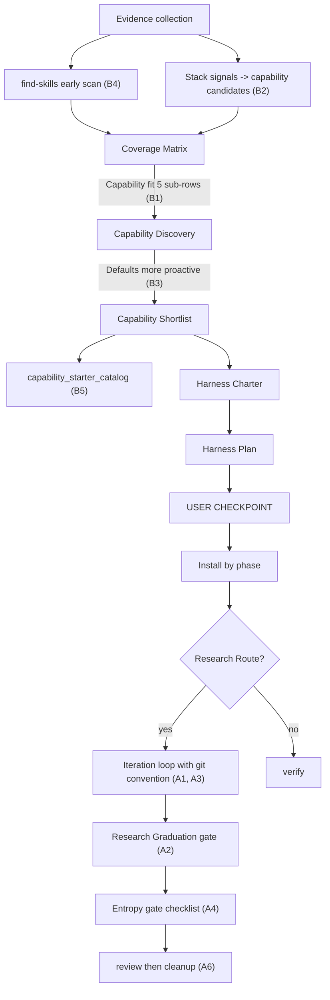

# Harness Builder 优化计划

## 范围与原则

- 全部改动落在 `skills/harness-builder/` 及其 references / templates，并同步到 `.cursor/skills/harness-builder/`（项目铁律：两份必须一致）。
- 仓库根 `AGENTS.md`、`README.md`、`docs/harness-method-contract.md` 不做语义重写；如果新增 mandatory gate 影响公共流程，仅在必要处补一两行说明。
- `init_scaffold` pack 不改；新增的 hook / subagent 模板走 `templates/hooks/` 和 `templates/agents/`，仍由 hook_policy / subagent_policy 决定是否安装。
- A2、B1、B3 涉及主流程或默认表，是 restructure；其余以 additive 为主。

## A 组｜autoresearch git 历史 / 代码熵

- **A1 — Commit / Branch / Tag 约定（additive）**：在 `[skills/harness-builder/references/research_route_policy.md](skills/harness-builder/references/research_route_policy.md)` 新增 "Git Convention" 段（分支 `research/<topic>`，tag `research/baseline|iter-N|winner`，commit trailer `Iter / Result / Metric / Decision`）；在 `[skills/harness-builder/templates/research_route/iteration_protocol.md.j2](skills/harness-builder/templates/research_route/iteration_protocol.md.j2)` 加 commit trailer 示例。
- **A2 — Research Graduation gate（restructure）**：
  - 在 `[skills/harness-builder/SKILL.md](skills/harness-builder/SKILL.md)` 的 "Mandatory execution gates" 末尾插入第 9 条 `Research Graduation gate`（仅 Research Route 触发，强制 winner 选择 + 合并模式 + branch 清理 checkpoint）。
  - 新增 `[skills/harness-builder/references/research_graduation_policy.md](skills/harness-builder/references/research_graduation_policy.md)`，描述三种合并模式（squash 单 commit / cherry-pick winner / rebase 删 failed），以及 winner 认定标准、未 winner 时的关闭路径、graduation 完成后调用 `cleanup` 的步骤。
  - SKILL.md step 8 末尾加一行链接到新 policy。
- **A3 — Worktree-first + manifest 字段（additive）**：在 research_route_policy.md 加 "Isolation default" 段；在 `[skills/harness-builder/templates/research_route/research_manifest.yaml.j2](skills/harness-builder/templates/research_route/research_manifest.yaml.j2)` 增加 `isolation: { mode: worktree|branch, path: ... }` 字段。
- **A4 — Research 收尾 Entropy Gate checklist（additive）**：新增 `[skills/harness-builder/references/research_entropy_gate.md](skills/harness-builder/references/research_entropy_gate.md)`（baseline LOC 对比、未引用 import/helper/test、临时数据夹、新增依赖回收、protected 路径恢复）；在 graduation policy 与 anti_entropy.md 中互链。
- **A5 — Knowledge 与 Code 解耦（additive）**：在 `[skills/harness-builder/templates/research_route/evidence_log.md.j2](skills/harness-builder/templates/research_route/evidence_log.md.j2)` 的 result 表加列 `Dead-end note`，并在文件末尾新增 "Failed hypothesis index" 段，要求每个 failed iteration 沉淀一条"为何此方向不可行"。
- **A6 — Research 收尾接 review + cleanup（additive）**：SKILL.md "Recommended next skill" 表加一行 `Research Route completes → review → cleanup`；research_route_policy.md 写明 "research 不直接声明 done，必须经过 review 和 cleanup"。

## B 组｜capability 推荐主动度

- **B1 — 拆分 Coverage Matrix 的 Capability fit 行（restructure）**：
  - 改 `[skills/harness-builder/references/coverage_matrix_policy.md](skills/harness-builder/references/coverage_matrix_policy.md)` 的 Rows 表，把 "Capability fit" 一行扩成 5 行（skills / hooks / MCP / subagents / external research），每行单独 `Required/Recommended/Deferred/Rejected`。
  - 同步改 SKILL.md "Coverage Matrix gate" 中那段列举的 coverage 区域文字。
- **B2 — Stack signal → capability 主动扫描（additive + 微调）**：在 `[skills/harness-builder/references/capability_signal_policy.md](skills/harness-builder/references/capability_signal_policy.md)` 新增 "Proactive scan from stack signals" 段；SKILL.md step 6 标题改成 `Run Capability Discovery for uncovered gaps and stack signals`，正文加一句"允许由 stack 形态直接产候选"。
- **B3 — 调整默认 classification 为更积极（restructure）**：
  - `[skills/harness-builder/references/hook_policy.md](skills/harness-builder/references/hook_policy.md)`：把"protected paths + 已知 fast linter/typecheck reminder + commit/branch guardrail"的默认从 optional 提到 `Recommended`。
  - `[skills/harness-builder/references/mcp_policy.md](skills/harness-builder/references/mcp_policy.md)`：把 read-only docs/repo/observability MCP 在 signal 命中时默认 `Recommended` 而非 `Deferred`。
  - `[skills/harness-builder/references/skill_policy.md](skills/harness-builder/references/skill_policy.md)`：repeated workflow / 项目级 domain skill 默认 `Recommended`。
  - `[skills/harness-builder/references/subagent_policy.md](skills/harness-builder/references/subagent_policy.md)`：`repo_explorer` 对大型/陌生 repo 默认 `Recommended`，security / api_contract / ml_reviewer 在 signal 命中时默认 `Recommended`。
  - 4 份 policy 都加一句"project-level harness builder 偏积极推荐，single-task 仍偏保守"以保留 verify/review 等 skill 的紧度。
- **B4 — find-skills 早期扫描（additive）**：SKILL.md step 1 evidence 段末尾加一句 "Optionally invoke `find-skills` 早期扫描 stack 相关 skill，结果写进 Capability Discovery"。
- **B5 — Capability starter catalog（additive）**：新增 `[skills/harness-builder/references/capability_starter_catalog.md](skills/harness-builder/references/capability_starter_catalog.md)`，按 stack/场景列推荐 starter capabilities（含 Python ML、TS 前端、Go 后端、含 secrets/auth、含 dataset/checkpoint、autoresearch 模式六类至少）；capability_signal_policy.md 链接它。

## C 组｜配套模板与 anti-entropy

- **C1 — 新 hook 模板**：新增 `[skills/harness-builder/templates/hooks/research_iteration_logger.py.j2](skills/harness-builder/templates/hooks/research_iteration_logger.py.j2)`、`[skills/harness-builder/templates/hooks/research_branch_push_guard.py.j2](skills/harness-builder/templates/hooks/research_branch_push_guard.py.j2)`、`[skills/harness-builder/templates/hooks/commit_trailer_enforcer.py.j2](skills/harness-builder/templates/hooks/commit_trailer_enforcer.py.j2)`；按需在 `hooks.json.j2` 占位中提及。
- **C2 — 新 subagent 模板**：新增 `[skills/harness-builder/templates/agents/research_critic.md.j2](skills/harness-builder/templates/agents/research_critic.md.j2)` 和 `[skills/harness-builder/templates/agents/failure_analyst.md.j2](skills/harness-builder/templates/agents/failure_analyst.md.j2)`；subagent_policy.md 的"Good subagents"列表追加。
- **C3 — Commit / branch convention 模板**：新增 `[skills/harness-builder/templates/commit_convention.md.j2](skills/harness-builder/templates/commit_convention.md.j2)`（含中文 commit、关键里程碑、与 A1 research trailer 对接）。
- **C4 — 合并到 B5**，不单独动。
- **C5 — SKILL.md `Recommended next skill` 增补 research path**：与 A6 合并执行。
- **C6 — anti_entropy 信号补强（additive）**：`[skills/harness-builder/references/anti_entropy.md](skills/harness-builder/references/anti_entropy.md)` 的 "Warning signs" 列表加 `failed-experiment leftover code`、`orphan research branches`、`unarchived research artifacts`、`capability candidates marked Deferred without revisit date`。

## 同步与验证

- 把 `skills/harness-builder/` 下所有改动镜像到 `.cursor/skills/harness-builder/`（项目铁律）。
- 跑：
  - `node scripts/check-plugin.mjs`
  - `node scripts/check-claude-code-install.mjs`
  - `node scripts/check-cursor-install.mjs`
  - `node scripts/install-cursor.mjs --target . --dry-run`
- 若任何 SKILL.md 段落结构改变（A2 加 gate、B1 拆行、B2 标题改），运行 `node scripts/generate-skill-flow-html.mjs` 重生成 `docs/skill-flow-review/*.html`，再次跑 `node scripts/check-plugin.mjs`。
- 完成后给一份 phase summary（修改/新增文件清单 + 验证证据）。

## 不做的事

- 不动 user-global config、Cursor MCP、user-level hooks。
- 不重写 `docs/harness-method-contract.md` / `README.md` / 根 `AGENTS.md` 的主体；只在必要处补一句 cross-link。
- 不向 `init_scaffold` pack 添加 hooks / MCP / subagent 安装能力（hard rule 禁止）。
- 不删除既有 reference / template / policy（preservation rule）。
- 不主动 commit；除非用户明确指示。

## 数据流（mermaid 概览）

